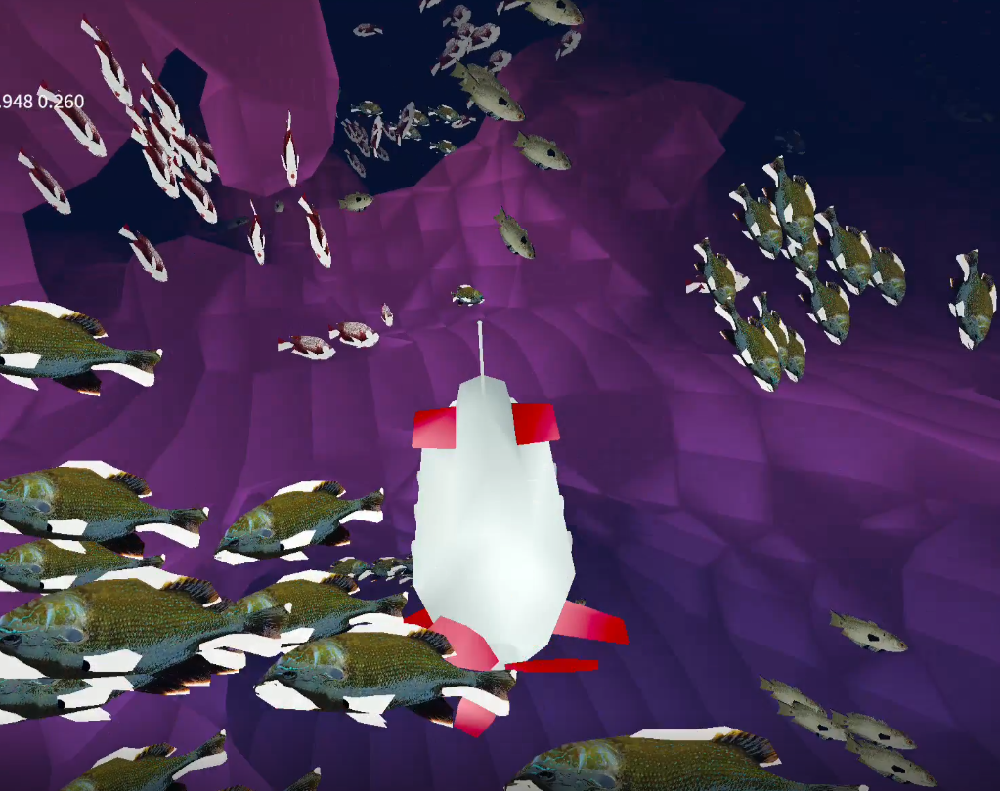
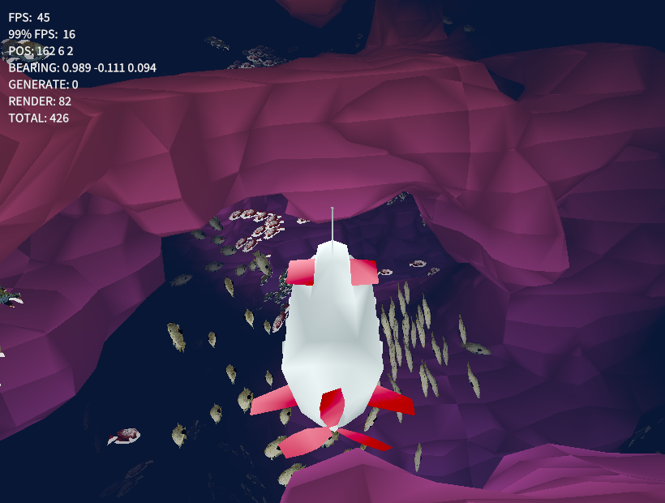

# Underwater World

Infinite explorable underwater world created using Rust and WGPU using marching cubes and 3D perlin noise.

## Controls

- Change pitch: WASD or arrow keys
- Roll: Q/E or pgUp/pgDown
- Speed up: space
- Slow down: control
- Reset submarine: R or enter

## Features

The main build target was WASM and WebGL, meaning I did not have access to any parallelism/threading or compute shaders.
This made performance a key concern, especially with the generation of the world/chunks and the fish. 
- Performance optimizations
    - Chunks/World
        - Each chunk is built one at a time and is split over multiple frames to keep the frame rate high
        - To hide the chunk generation, the chunks to build are sorted:
            1) If they are in the view frustum
            2) If they are in the direction that the sub is facing
            3) Distance to sub but with a little extra prio to chunks with a lower Z value (because they are more likely to be not blank)
        - After collecting the perlin noise values for a chunk, if the chunk will be blank, it skips trying to create the mesh and it will skipped for rendering
        - Built chunk models are stored and sent to the GPU in a more compact way using index buffers
        - Despite the fact that chunks take up 16x16x16 voxels, they are built out of 12x12x12 voxels
        - When trying to render the chunks, it will only sent chunks that in the view frustum to the GPU
        - vertex order is designed for backface culling
    - Boids
        - Index buffer + backface culling for models
        - Spatial partitioning used to find boids that are close to each other instead of iterating through all boids
        - If boids get too far from a point, they are teleported to the opposite side
            - The center point is a space in the direction the sub is facing, as there is no point in having the boids be far away from the sub or behind the sub
- Other features
    - Marching cubes with linear interpolation based on the isosurface values
    - 3D multi-octave perlin noise to generate infinite terrain
    - Boids
        - Wall avoidance using raycasting
    - Shader effects:
        - Fog: further away objects fade into the sea
        - Darker/deeper: the deeper you go, the darker the fog/water color gets
        - The fish have a swimming animation that moves some of their vertices left and right using a sine wave
        - The sub has a light that illuminates the direction it is facing

## Assets

- Submarine: antonmoek - https://www.cgtrader.com/free-3d-models/vehicle/other/low-poly-cartoon-submarine
- Red fish: 3DRPolyFactory - https://www.cgtrader.com/free-3d-models/animals/fish/fish3d-v1
- Green fish: 3DRPolyFactory - https://www.cgtrader.com/free-3d-models/animals/fish/fish-3d-6a34c6e0-dff2-4375-9257-469577d423cd
- Blue fish: 3DRPolyFactory - https://www.cgtrader.com/free-3d-models/animals/fish/bluegill-886e1016-26b4-49c2-a594-799da26c1ce7
- Favicon: Smashicons - https://www.flaticon.com/free-icon/submarine_2739364?term=submarine&page=1&position=22&origin=tag&related_id=2739364

## Resources

- https://sotrh.github.io/learn-wgpu/
- Marching Cubes/World Generation
    - https://www.youtube.com/watch?v=M3iI2l0ltbE
    - https://paulbourke.net/geometry/polygonise/
    - https://developer.nvidia.com/gpugems/gpugems3/part-i-geometry/chapter-1-generating-complex-procedural-terrains-using-gpu
    - https://people.eecs.berkeley.edu/~jrs/meshpapers/LorensenCline.pdf
    - https://www.youtube.com/watch?v=YyVAaJqYAfE
    - https://www.youtube.com/watch?v=TZFv493D7jo
    - https://www.youtube.com/watch?v=4O0_-1NaWny
- Boids
    - https://stackoverflow.com/questions/9600801/evenly-distributing-n-points-on-a-sphere/44164075#44164075
    - https://www.youtube.com/watch?v=bqtqltqcQhw
    - https://natureofcode.com/book/chapter-6-autonomous-agents/
    - https://www.red3d.com/cwr/boids/
    - https://www.youtube.com/watch?v=gpc7u3331oQ
    - https://eater.net/boids
    - https://github.com/miorsoft/VB6-3D-Flocking-Boids
    - https://github.com/albertomelladoc/Fish-Animation/blob/master/FishAnimation.shader
- Techniques from old projects:
    - https://lelserslasers.itch.io/boids
    - https://lelserslasers.itch.io/3d-cellular-automata-wgpu-rust
    - https://lelserslasers.itch.io/minecraft